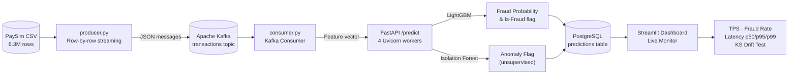
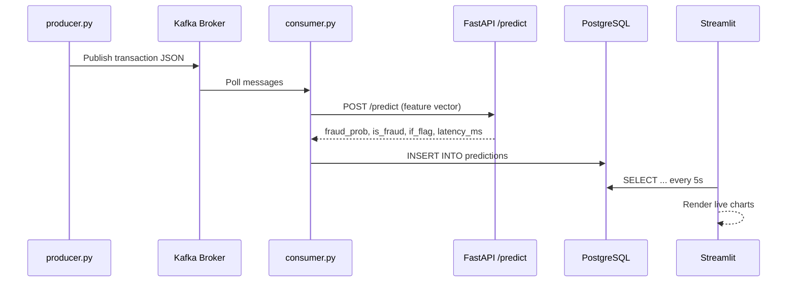
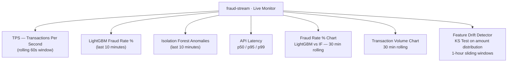

# fraud-stream

A production-quality, end-to-end real-time fraud detection system. Transactions stream from a financial dataset through Apache Kafka, scored in real time by a **LightGBM classifier** and an **Isolation Forest anomaly detector** served via FastAPI, with results persisted to PostgreSQL and visualised on a live Streamlit dashboard deployed on AWS EC2.

> **Live Dashboard:** [http://13.49.244.196:8501](http://13.49.244.196:8501)
> *(The Kafka data stream is paused by default to conserve AWS resources. Start the producer to see live data flow.)*

---

## Architecture



---

## Data Flow — Step by Step



---

## Tech Stack

| Layer | Technology |
|---|---|
| Message broker | Apache Kafka + Zookeeper (Confluent CP 7.6) |
| ML — Supervised | LightGBM 4.5 |
| ML — Unsupervised | Isolation Forest (scikit-learn) |
| Inference API | FastAPI 0.115 + Uvicorn (4 workers) |
| Database | PostgreSQL 16 |
| Dashboard | Streamlit 1.41 |
| Load testing | Locust 2.32 |
| Orchestration | Docker Compose (6 containers) |
| Deployment | AWS EC2 (Ubuntu 26.04, t2.micro) |

---

## Model Performance

### LightGBM (Supervised)

| Metric | Value |
|---|---|
| Dataset | PaySim (6.3M transactions) |
| Fraud rate | ~1.3% |
| Features | 13 (amount, balance deltas, transaction type one-hot) |
| Imbalance handling | `scale_pos_weight` ≈ 76 |
| AUC-PR | ~0.72 |
| AUC-ROC | ~0.99 |
| Fraud recall @ threshold 0.5 | ~90% |

### Isolation Forest (Unsupervised — no labels used)

| Metric | Value |
|---|---|
| Contamination | 0.013 (matches PaySim fraud rate) |
| n_estimators | 100 |
| Use case | Catches distributional anomalies the supervised model misses |

---

## Dashboard Features



### Fraud Classification System

The dashboard interprets the combined output of both ML models into plain-English classifications for easy monitoring:
- **Guaranteed Scam (Red):** The transaction matches known historical fraud patterns (LightGBM) **AND** looks like a statistically bizarre outlier (Isolation Forest).
- **Stealthy Fraud (Orange):** The transaction matches known fraud patterns (LightGBM), but blends in with normal behavior mathematically (no Isolation Forest anomaly).

### Engineering Highlights
- **Ensemble Model Inference:** Synthesizes supervised learning (LightGBM) and unsupervised anomaly detection (Isolation Forest) to build a robust, multi-layered defense mechanism.
- **Robust UI State Management:** Employs URL parameter synchronization and custom JavaScript rendering to ensure dashboard configurations persist flawlessly during real-time streaming. Includes precision controls for **Auto-Refresh Rates** (5s to 1m), **Time Windows** (10m to 3h), and **Chart Resolutions** (5s to 30m).
- **Dynamic Theming Engine:** Integrated Plotly and CSS styling that seamlessly transitions between Dark, Light, and Eye-Protection modes dynamically without reloading the data layer.

---

## Running Locally

### Prerequisites
- Docker Desktop
- Python 3.12+
- PaySim dataset from [Kaggle](https://www.kaggle.com/datasets/ealaxi/paysim1)

### Steps

```bash
# 1. Clone and configure
git clone https://github.com/stackSentinel-32/fraud-stream.git
cd fraud-stream
cp .env.example .env

# 2. Place the PaySim dataset
mkdir data
mv /path/to/PS_20174392719_1491204439457_log.csv data/paysim.csv

# 3. Start the full stack (Kafka + Postgres + API + Consumer + Dashboard)
docker compose up --build

# 4. Start the producer in a separate terminal (simulates live traffic)
python producer/producer.py

# 5. Open the dashboard
open http://localhost:8501

# 6. Optional: run the load test
locust -f loadtest/locustfile.py --host http://localhost:8000
# Then open http://localhost:8089
```

---

## Project Structure

```
fraud-stream/
├── docker-compose.yml       # 6-container stack orchestration
├── Dockerfile               # shared base image (api, consumer, dashboard)
├── requirements.txt         # pinned Python dependencies
├── .env.example             # environment variable template
├── model/
│   ├── train.py             # LightGBM + Isolation Forest training pipeline
│   ├── model.pkl            # trained LightGBM artifact
│   ├── isolation_forest.pkl # trained Isolation Forest artifact
│   └── feature_columns.json # feature schema shared across all services
├── producer/
│   └── producer.py          # streams PaySim CSV rows into Kafka
├── consumer/
│   └── consumer.py          # reads Kafka → calls API → writes to Postgres
├── api/
│   └── main.py              # FastAPI scoring endpoint (LightGBM + IF)
├── dashboard/
│   └── dashboard.py         # Streamlit live monitor with KS drift test
├── loadtest/
│   └── locustfile.py        # Locust load test targeting /predict
└── db/
    └── init.sql             # PostgreSQL schema (auto-runs on first start)
```

---

## What I Would Improve With More Time

1. **Exactly-once Kafka delivery** — current at-least-once semantics can produce duplicate DB writes on consumer crash. Kafka transactions + idempotent `INSERT ... ON CONFLICT DO NOTHING` on `transaction_id` would fix this.

2. **MLflow model versioning** — `model.pkl` is a single unversioned artifact. MLflow would enable experiment tracking, A/B testing two models on live traffic, and one-command rollback.

3. **Prometheus + Grafana** — Streamlit polls Postgres every 5s which is fine for a demo. Production alerting needs sub-second metrics and configurable alert rules.

4. **Dead letter queue** — malformed Kafka messages are currently logged and dropped. A `transactions.dlq` topic would preserve every bad message for debugging and replay.

5. **Async consumer** — the `predict_via_api` HTTP call is synchronous. Rewriting with `asyncio` + `httpx.AsyncClient` would significantly increase consumer throughput.

6. **Automated retraining** — an Airflow DAG could trigger `train.py` weekly on fresh data whenever the KS test flags distribution drift.
